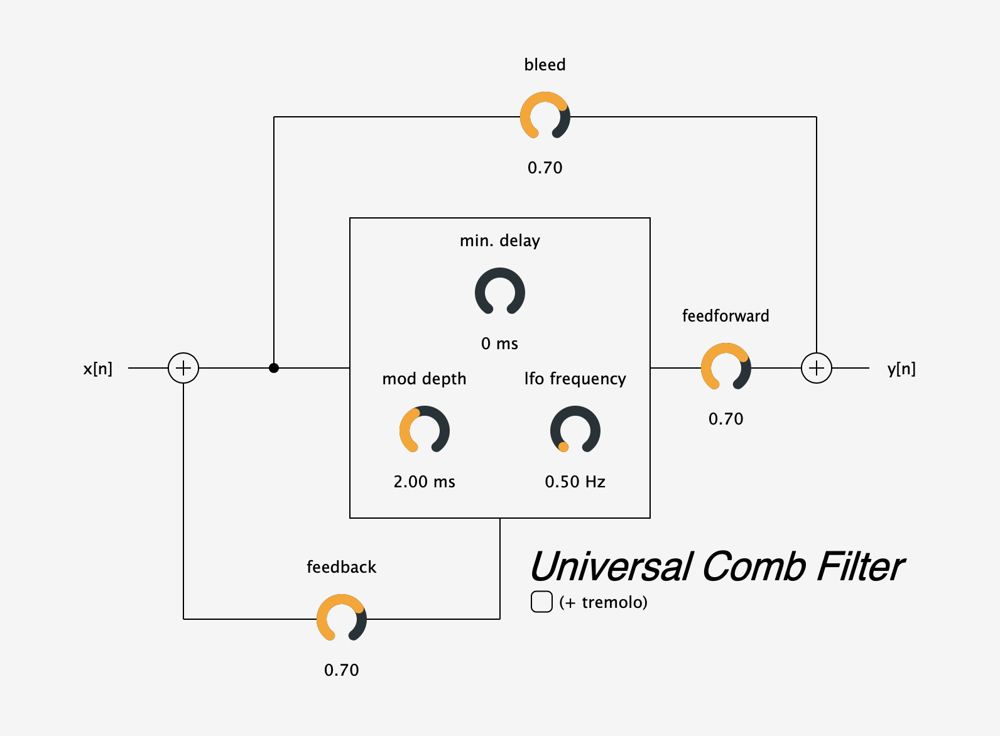

# Universal Comb Filter

The universal comb filter is a simple demonstration the vast array of effects made possible by delay-based filtering. The filter is **universal** due to its innate ability to function as a delay, chorus, flanger, vibrato, ring mod, and (in this implementation) tremolo.

The GUI is designed to mimic the block diagram reresentation of the filter, allowing users to tweak feedforward, feedback, and bleed coefficients in realtime with an accurate graphical representation of the data flow.

The amount of delay can be tweaked and adjusted over time via a built-in LFO with frequency and depth knobs.

# Installation

